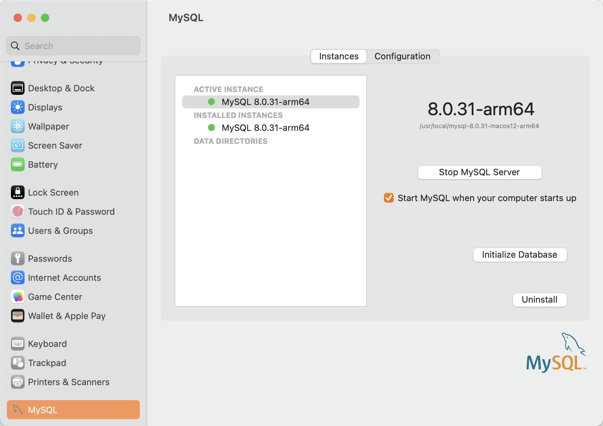
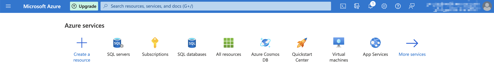
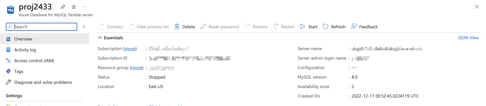
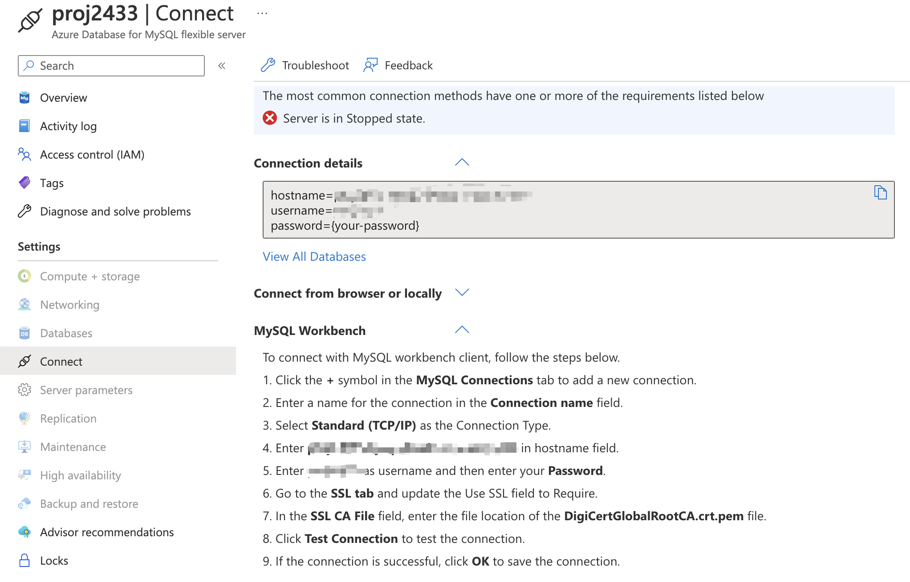
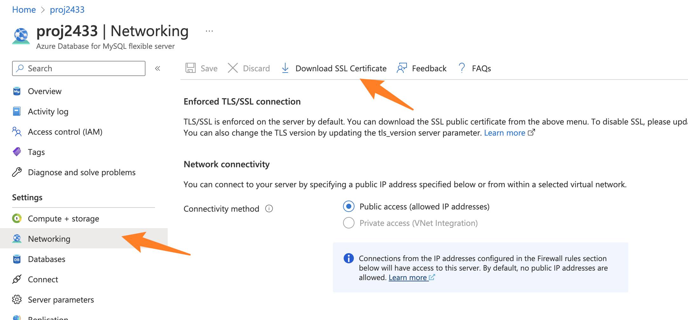

# CSCI-GA 2433 Final Project

## Description:
In this part, we will create an interactive system to connect to MySQL through Python to interact with the database.

The interactive system includes show tables, select tables, update(insert, delete, and update) the data. 
In addiction, this interactive system also include the code from project3(Machine Learning part). 

We expect we could use the machine learning part to predict medical insurance price, and add the price into the table.
We use python (in the jupyter notebook) to calculate the weight of the [Medical Insurance Premium Prediction](https://www.kaggle.com/datasets/tejashvi14/medical-insurance-premium-prediction) data, and export the weights into Python to predict the price.

## 1. Set up
1) Download and install [MySQL Community Server](https://dev.mysql.com/downloads/mysql/).

2) After install, make sure you start the server and check the version of your MySQL Server:

Here we get 8.0 version.

3) Download and install [MySQL Workbench](https://dev.mysql.com/downloads/workbench/).

4) We are using [Microsoft Azure](https://azure.microsoft.com/en-us/) as our big cloud's server. Sign in and log in.

5) Click the "Create a resource", and choose "SQL Database". Please make sure the MySQL version is same as step2. (My version is 8.0)

6) Click the "Connect", and do the MySQL Workbench guide step by step.

The SSL CA File is in the Setting-Networking, need to download.
