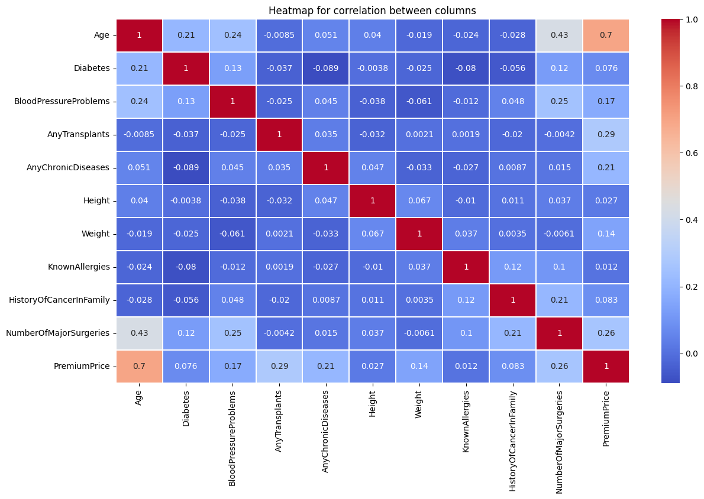
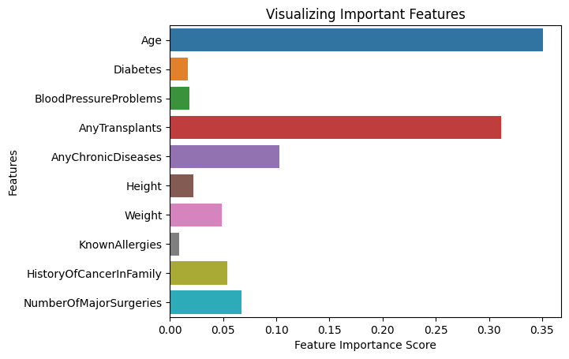

# CSCI-GA 2433 Project (Software Portion)

## Description:
The project is about creating a database and interactive system for an insurance company. 

The project's first two parts are creating ER diagram and schema for the database. The third part of the project is finding a dataset that could help the insurance company and do the machine learning for this dataset. Finally, we need to finish the interactive system for the database.

This GitHub includes the software portion of part 3 and the final part.

### For ML part:
**Data hot map**:

**Visulizing Important Features from XGboost**:

### For Interactive System：

**Survey part for calculating insurance price**:

**Insert**:

**Delete**:

**Update**:

## Files
1. **setup.md**: The tutorial on connecting to the Microsoft Azure server
2. **Project_3_ML_part**: Including the Software Portion of project 3
    1. **Project3.ipynb**: The machine learning part, including Linear regression, Random Forest, XGBoost, etc.
    2. Please go to [Kaggle](https://www.kaggle.com/datasets/tejashvi14/medical-insurance-premium-prediction) to download data.
3. **Project_Final_Interactive_part**: An interactive system to connect to MySQL through Python to interact with the database.
    1. **code**: Contains all the code of this project.
        1) **config.yaml**: Contains the config connected to the server.
        2) **get_client_flags.py**: Get the client flag, which is needed when modifying the yaml file.
        3) **config_from_yaml.py**: Convert the yaml file into a dictionary.
        4) **mysql2python.py**: Contains all the code connecting Python and MySQL (show tables, get columns, get data, insert, delete and update)
        5) **web.py**: The main file of this project contains Python flask code.
        6) **templates**: Contains all html files.
        7) **xgb_reg.pkl:** The weight of Machine Learning model from project 3.